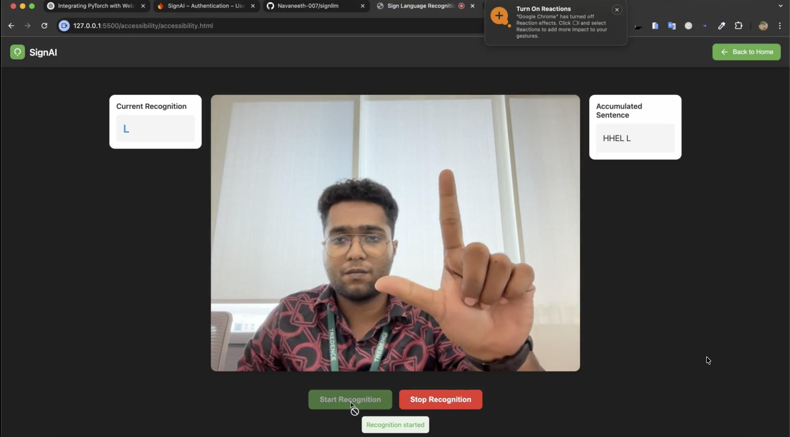
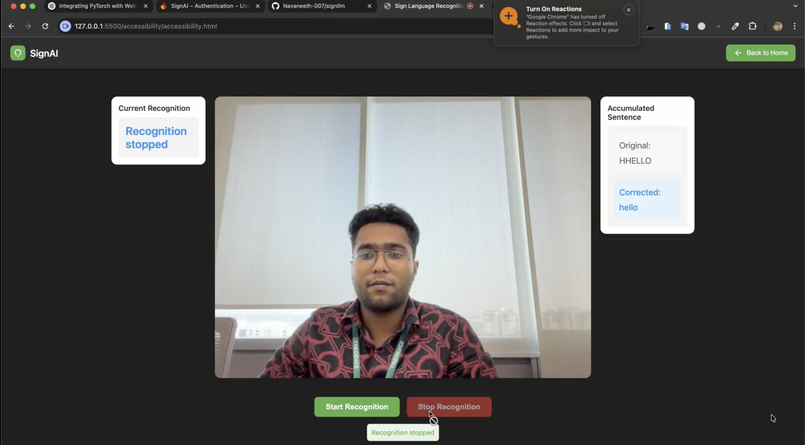

# SignAI 2.0 – AI-Powered Sign Language Recognition

> **SignAI 2.0** is the next-generation version of SignAI, featuring improved sign language recognition, enhanced AI models, faster inference, and a more refined user experience. Built upon SignAI 1.0, this version focuses on delivering higher accuracy and smoother real-time interaction.

---

## 📖 Overview

SignAI 2.0 is an AI-powered web application that recognizes sign language gestures in real time using a webcam and converts them into readable text and natural speech. The system combines computer vision, machine learning, and natural language processing to provide an accessible communication tool for sign language users.

Compared to **SignAI 1.0**, this version introduces improved recognition accuracy, continuous sentence formation, automatic spell correction, enhanced speech synthesis, and a cleaner, more responsive interface.

---

## ✨ Features

- 🤟 Real-time sign language recognition using a webcam
- 🧠 Enhanced machine learning model for improved recognition accuracy
- ✍️ Automatic spell correction
- 📝 Continuous word and sentence formation
- 🔊 Text-to-Speech (TTS) conversion
- 📷 Real-time hand tracking using MediaPipe
- ⚡ Faster inference and optimized performance
- 🎨 Modern, responsive, and user-friendly interface

---

## 📸 Screenshots

### 🤟 Real-Time Recognition

  

The application captures live webcam input, detects hand landmarks using MediaPipe, and performs real-time sign language recognition.

---

### ✅ Recognition Result

  

The recognized gesture is converted into text, automatically corrected if necessary, and can be spoken aloud using the integrated Text-to-Speech engine.

## 🛠️ Technology Stack

### Frontend

- HTML5
- CSS3
- JavaScript
- MediaPipe Hands
- Web Speech API

### Backend

- Python
- Flask
- OpenCV
- MediaPipe
- Machine Learning Model
- gTTS (Google Text-to-Speech)

---

## 🆕 Improvements Over SignAI 1.0

- Improved sign recognition accuracy
- Better-trained machine learning model
- Faster real-time inference
- Continuous sentence generation
- Automatic spell correction
- Improved speech synthesis
- Cleaner and more intuitive UI
- Better overall user experience

---

## 📄 License

This project is licensed under the MIT License.

---

## 👨‍💻 Author

**Navaneeth S**

M.Tech in Computer Science (Artificial Intelligence & Machine Learning)

Amrita School of Computing
